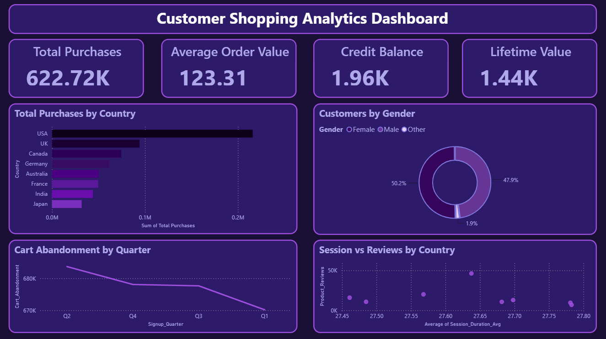

# Customer Shopping Analytics

## Project Overview

This project focuses on analyzing customer shopping behavior using Python and Power BI. The dataset was cleaned, analyzed, and visualized to identify customer trends, purchasing patterns, engagement behavior, and business opportunities.

---

## Tools & Technologies

- Python
- Pandas
- NumPy
- Matplotlib
- Seaborn
- Power BI
- SQL

---

## Project Workflow

### 1. Data Cleaning
- Handled missing values
- Checked duplicate records
- Verified data types
- Prepared dataset for analysis

### 2. Exploratory Data Analysis (EDA)
- Customer demographics analysis
- Purchase behavior analysis
- Engagement analysis
- Correlation analysis
- Outlier detection using box plots

### 3. Data Visualization
- Bar Charts
- Line Charts
- Donut Charts
- Scatter Plots
- Correlation Heatmaps

### 4. Power BI Dashboard
Created an interactive dashboard containing:
- Total Purchases KPI
- Average Order Value KPI
- Credit Balance KPI
- Lifetime Value KPI
- Customers by Country
- Customers by Gender
- Cart Abandonment Trend
- Session Duration vs Product Reviews

---

## Key Business Insights

- USA has the highest customer base among all countries.
- Customer distribution is nearly balanced across genders.
- Cart abandonment shows a declining trend from Q2 to Q1.
- Customers with longer session durations tend to write more product reviews.
- Average Order Value is 123.31.
- Average Lifetime Value is 1.44K.

---

## Project Structure

```text
Customer-Shopping-Analytics
│
├── dashboard
│   └── Customer_Shopping_Analytics_Dashboard.pbix
│
├── data
│
├── images
│
├── notebooks
│
├── sql
│
├── README.md
│
└── requirements.txt
```

---

## Dashboard Preview




---

## Author

Sejal Chavan

Aspiring Data Analyst | Python | SQL | Power BI
